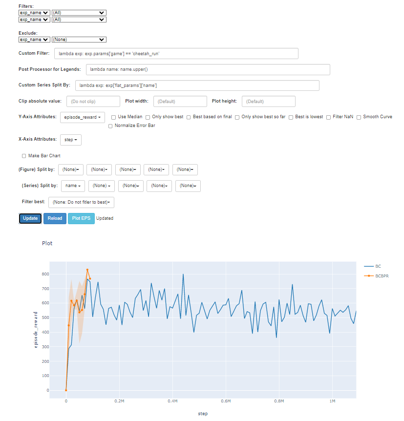

# visualkit

Mostly copy/pasted from [viskit](https://github.com/vitchyr/viskit).

Added some features.

## Usage

```
python viskit/frontend.py path/to/dir
```

This assumes the structure of dir is something like:

path/
    to/
        dir/
            exp1/
                progress.csv
                variant.json
            exp2/
                progress.csv
                variant.json

Note that this support wildcard, i.e.

```
python viskit/frontend.py path/to/dir/exp*
```


e.g. `python viskit/frontend.py ./logs/ --data-filename eval.csv`


## Installation

Install this repository using pip:

```
pip install -e .
```


## Visualization on website




​	press the button "Plot EPS" to get the .pdf figure.